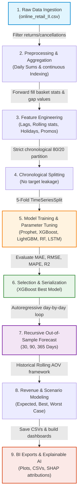

# 📈 RevenueVision AI: Demand & Revenue Forecasting System

An end-to-end, production-ready time-series forecasting system that predicts future order volumes and projects financial revenues for an e-commerce business. Utilizing transaction-level records, the system builds, validates, and compares **five predictive models** (Prophet, XGBoost, LightGBM, Random Forest, and LSTM) using rigorous chronological cross-validation and recursive forecasting logic to support strategic business planning.


## 🔄 ML Lifecycle & Pipeline Workflow



---


## 📸 Key Visual Highlights

### 1. Future Demand & Revenue Forecast (365-Day Horizon)
Recursive daily projections of order volumes and risk-adjusted financial revenue alongside a $\pm20\%$ operational confidence interval.

| Order Demand Forecast | Projected Financial Revenue |
| :---: | :---: |
|  |  |

---

### 2. Model Performance & Evaluation
Comparing predicted vs. actual order volumes on the unseen test partition and benchmarking Mean Absolute Percentage Error (MAPE) across models.

| Actual vs. Predicted Orders (XGBoost) | Model Benchmark Comparison (MAPE %) |
| :---: | :---: |
|  |  |

---

### 3. Seasonality Patterns & Explainable AI (SHAP)
Decomposing hourly sales into day-of-week and month patterns, combined with SHAP feature attributions showing why forecasts are generated.

| Seasonality Analysis | SHAP Feature Attribution |
| :---: | :---: |
|  |  |

---

## 🛠 What Was Accomplished (System Pipeline)

1. **Robust Ingestion & Cleaning**:
   - Processed transaction records from `online_retail_II.csv`.
   - Excluded return orders (invoices starting with `C` or non-positive quantities/prices) and removed duplicate rows.
2. **continuous Indexing & Gap Filling**:
   - Reindexed raw timestamp sequences to a daily frequency to prevent timeline gaps.
   - Filled inactive days (zero orders/revenue) and forward-filled Average Order Value (AOV).
3. **Feature Engineering**:
   - Extracted calendar variables (Day of week, month, quarter, year, week of year, weekend indicators).
   - Generated UK Bank Holidays via the `holidays` library.
   - Modeled simulated promotional flags corresponding to major retail events (Black Friday, Cyber Monday, Christmas, and quarterly clearances).
   - Computed recursive lags (1, 7, 14, 30 days), rolling averages (mean, standard deviation over 7, 14, 30 days), and growth features.
4. **Chronological Splitting (80-20)**:
   - Partitioned the time series chronologically into training (80%) and testing (20%) datasets without shuffling to prevent target leakage.
5. **Multi-Model Development**:
   - Developed **5 distinct modeling techniques**: Facebook Prophet, XGBoost, LightGBM, Random Forest, and LSTM (TensorFlow Keras).
   - Employed `TimeSeriesSplit` cross-validation with grid search parameter tuning.
6. **Recursive Forecasting & Scenario Analysis**:
   - Implemented a day-by-day recursive forecasting loop to dynamically feed forward predictions as future lags and rolling stats.
   - Mapped order volumes to rolling AOV ($665.47) for revenue projections.
   - Engineered three scenario projections: **Expected**, **Best Case** ($1.20 \times \text{Expected}$), and **Worst Case** ($0.80 \times \text{Expected}$).
7. **Explainable AI**:
   - Generated SHAP tree explanations mapping feature attributions.

---

## 📊 Benchmarking Results

| Model | MAE | RMSE | MAPE (%) | $R^2$ Score | Selection Status |
| :--- | :---: | :---: | :---: | :---: | :---: |
| 🏆 **XGBoost** | **3.76** | **5.26** | **6.42%** | **0.980** | **Selected Best Model** |
| ⚡ LightGBM | 4.49 | 7.14 | 7.75% | 0.963 | Backup |
| 🌲 RandomForest | 4.27 | 7.39 | 7.84% | 0.960 | Backup |
| 📈 Prophet | 13.07 | 16.99 | 18.19% | 0.791 | Baseline |
| 🧠 LSTM | 17.55 | 21.74 | 21.03% | 0.671 | Baseline |

---

## 📂 Project Structure

```bash
RevenueVision_AI_Project/
├── RevenueVision_AI.ipynb  # Comprehensive, fully documented Jupyter Notebook (20 sections)
├── pipeline.py             # Executable production Python script running the entire pipeline
├── data/
│   └── online_retail_II.csv # Input dataset (must be placed here before executing)
├── exports/
│   ├── forecast_30_days.csv # 30-day forecast horizons (Orders & Revenue scenarios)
│   ├── forecast_90_days.csv # 90-day forecast horizons
│   ├── forecast_365_days.csv# 365-day complete forecast horizons
│   ├── revenue_forecast.csv # Projected daily financial revenue scenarios
│   └── model_metrics.csv    # Benchmark table for all models
├── models/
│   ├── best_model.joblib    # Serialized production XGBoost model
│   ├── xgboost_model.joblib # Model weights
│   ├── lightgbm_model.joblib# Model weights
│   ├── random_forest.joblib # Model weights
│   ├── lstm_model.h5        # Model weights
│   ├── best_lstm_weights.keras # Checkpointed Keras weights
│   └── prophet_model.pkl    # Serialized Prophet model
└── plots/
    ├── actual_vs_predicted.png
    ├── confidence_intervals.png
    ├── feature_importance.png
    ├── future_forecast.png
    ├── model_comparison.png
    ├── revenue_forecast.png
    ├── seasonality.png
    ├── shap_summary.png
    └── trend_analysis.png
```

---

## 🚀 Setup & Execution

### Prerequisites
Make sure Python 3.10+ is installed on your machine.

### Installation & Run

1. **Clone/Open the workspace** in your preferred editor.
2. **Ingest the Raw Data**: Place the `online_retail_II.csv` dataset in the `data/` directory.
3. **Execute the Jupyter Notebook**:
   - Open [RevenueVision_AI.ipynb](RevenueVision_AI.ipynb).
   - Run Section **2.5** (Auto-Install cell). It will dynamically verify and install all missing dependencies directly into your current kernel environment:
     ```python
     # Installs numpy, pandas, xgboost, lightgbm, tensorflow, shap, prophet, etc. if missing.
     ```
   - Run all cells to execute the pipeline.
4. **Execute via Terminal**:
   - Alternatively, you can run the full pipeline script from your command line:
     ```bash
     python pipeline.py
     ```

---